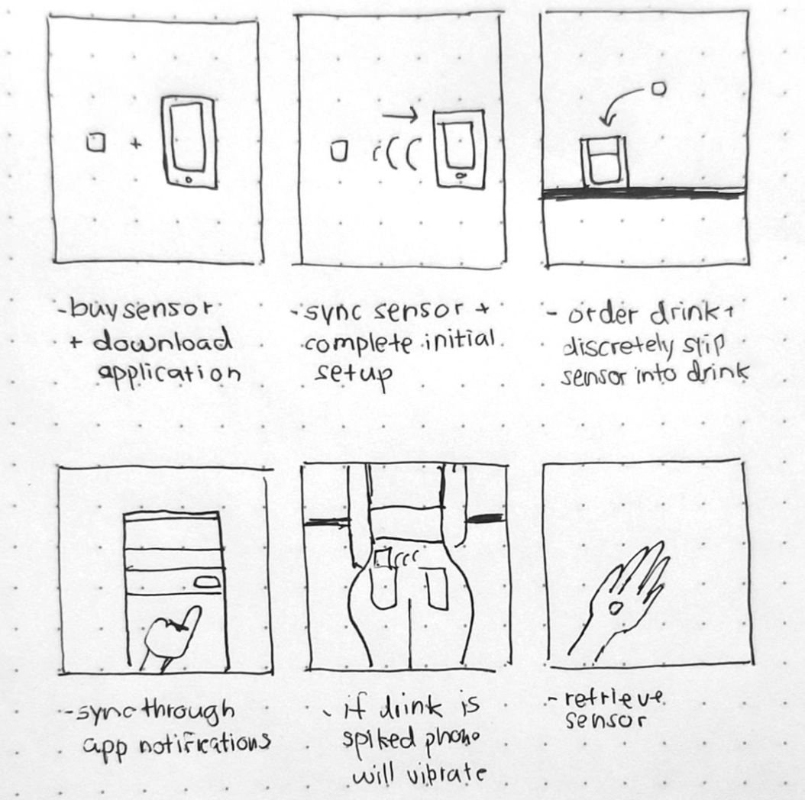
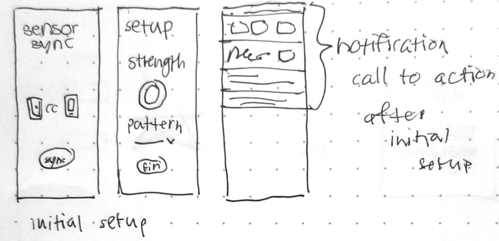
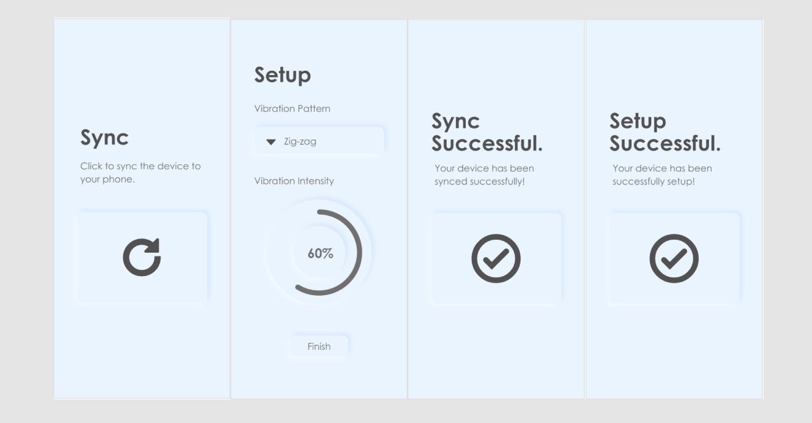

## Summary

VibeGlass is the second part of our speculative design project, where we were assigned to add an electronic component to our initial haptic design concept. We developed a simple prototype to demonstrate our drug detector glass-attachment components in the first part of our speculative design project. In this project, we were able to expand our device by creating an interactive prototype for an application meant to further enhance the safety features of VibeGlass. In addition, we speculated ideas for how our device may increase its impact by connecting to the Internet of Things (IoT).

## Problem

Our second speculative design project had several aims:

- Create a way for notifying users of a drug detection discreetly, yet instantly — ensuring that the alert would not be accidentally missed
- Give users more control over their haptic experience with the VibeGlass devices and detectors
- Speculate ways to further enhance users' safety through connecting our device to the IoT

To succeed in these areas, we went forward with conceptualizing a smartphone application to go with our drug detector components.

## Process

We began with a discussion about how the companion application would work alongside our drug detections, and how it would fit into the user's overall experience with VibeGlass. The details we agreed on were then depicted within a storyboard:

The VibeGlass application would allow users to be silently notified about any occurrences of drug-spiking upon detection. This instant alert would be sensed both through the glass, as well as through the user's phone when enabled through the VibeGlass application. Before creating our interactive prototype for the VibeGlass application, sketches were created to demonstrate its main features, as well as to give an idea of what the user flow would be within the app. 

Our prototype was then created in Adobe XD to create a fully interactive demonstration of the customized vibration alert system our application was meant to achieve. Each member of the team reviewed the screens and provided feedback for usability adjustments.

I mainly worked on finding ways for our product to be integrated into the IoT. Audience feedback from our previous presentation indicated that it would be useful for the VibeGlass drug detectors to collect data with each incident of drug detection. Looking at the current capabilities of the IoT, I imagined that this data could be used by smart security systems embedded into entertainment venues and used by venue managers, stakeholders, and even law enforcers to better understand the current state of security within these venues and determine what specific measures should be taken to better ensure customers' safety.

## Reflection

The main challenge with completing this project was working amidst unexpected university closures. This required adapting to remote work, which was a bit of a jarring change when working on a collaborative design project. 

In the end, having journey maps and sketches were effective in moving our project forward. They provided a tangible vision for what VibeGlass was meant to achieve for its users which allowed us to create a fully interactive prototype for users to explore and test.

Not having access to our physical prototype was difficult, and trying to convey the purpose of our our vibro-tactile product through only words and images was challenging as well. I think the remote phase of this project ultimately helped me to understand what it takes to work within a remote design team and how to collaborate without in-person meetings.
